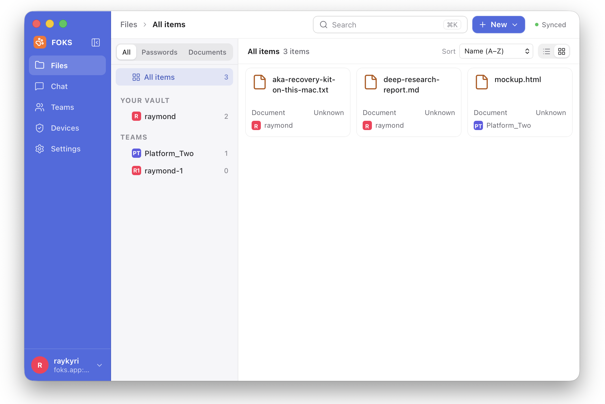

# foks-rs

A Rust implementation of FOKS, the federated open key store
protocol. Includes client and server libraries, command-line tools, a
local agent, and a Tauri desktop application.

The desktop app is a client for the local FOKS agent. The FOKS agent
owns credentials, sessions, protocol verification, resumable
operations, and access to personal and team key-value stores.

<picture>
  <source
    media="(prefers-color-scheme: dark)"
    srcset="docs/foks-rs-desktop-heavy.png"
  />
  
</picture>

Desktop screenshots: [Light mode](docs/foks-rs-desktop-light.png) ·
[Dark mode](docs/foks-rs-desktop-heavy.png).

The local agent stores hard state and cached soft state in separate
SQLite databases per profile. The standalone server uses an
authoritative SQLite database with a single writer and concurrent WAL
read connections.

Transactions are used to atomically update multiple tables, while
writes are serialized per database. High-traffic deployments require
attention to transaction duration, writer queueing, checkpointing, and
backup strategy. SQLite can perform well for this architecture;
performance relative to PostgreSQL-based FOKS depends on workload.

## Development

Install the Rust toolchain declared in `rust-toolchain.toml`, the exact Node.js
version in `.node-version`, and the npm version declared in `package.json`, then
install frontend dependencies:

```sh
npm install --global "$(node -p "require('./package.json').packageManager")"
npm ci

npm run dev             # Run with auto-reload, and a local FOKS server and agent
npm run start           # Run with auto-reload, for an existing FOKS agent

npm run bundle:macos    # Create bundled DMG
VITE_FOKS_MOCK=1 npm run build:frontend # Build frontend-only mock for browser testing
```

Tests and checks:

```sh
npm run test:core       # seven core Rust crates + UI tests
npm run test:full       # entire Rust workspace + UI tests
npm run format
npm run lint
npm run typecheck
npm run test:foks-ui      # full UI test suite, including the notification scale case
npm run test:foks-ui:fast  # ordinary UI iteration
npm run test:foks-ui:scale # production-size notification rotation
npm run test:rust:scale   # production-size incremental history
```

`cargo` builds and tests the Rust packages. npm drives Vite, TypeScript,
ESLint, UI tests, and the Tauri CLI.

- The complete desktop and release workflow and platform prerequisites are documented in
  [`apps/desktop/src-tauri/README.md`](apps/desktop/src-tauri/README.md).
- Protocol and server validation live under [`tools/foks-server/`](tools/foks-server/)
- The pinned Go compatibility oracle lives under [`tools/foks-v019-oracle/`](tools/foks-v019-oracle/).

The FOKS project is pre-v1. Compatibility with the upstream Go protocol is
tested explicitly; internal storage and application schemas may otherwise
change without migration support.

`npm test` aliases `test:core`. Full tests need native desktop dependencies;
explicitly ignored hardware, hosted, and real-agent tests remain opt-in.
`npm run test:rust:core` and `npm run test:rust:full` run only Rust tests.
The full commands retain the production-size cases; the ordinary agent unit
suite uses a smaller history page to cover the same cursor boundaries quickly.
`test:rust:full` builds the standalone agent first and includes `test:rust:scale`.
Both Rust commands accept build flags, for example `-- --release`.
For a focused UI edit, pass the affected files directly to `npx tsx --test`.

Use `npm run build` for the platform production bundle: an application and DMG
on macOS, or a Debian package on Linux. Run
`npm run test:foks-desktop:packaged` after building the macOS bundle.
`npm run build:release` is the fail-closed macOS release path. It loads the
repository's optional `.env`, preserving already-exported environment values,
and requires the signing identity and Apple notarization credentials before
it builds anything. Notarization accepts an Apple app-specific password in
`APPLE_APP_PASSWORD` or, when that is unset or empty, `APPLE_PASSWORD`.

## Benchmarks

The real-process chat benchmark runs desktop TypeScript services against release
Rust agent and server processes, with six incoming messages per second and
concurrent foreground history reads and message writes. Linux x86_64 results with
notifications enabled:

| Workload | After |
| --- | ---: |
| Steady traffic, 70 channels | 43.7 ms |
| Message backlog, 70 channels | 38.4 ms |
| Steady traffic, 200 channels | 45.1 ms |

Values are medians of three trial p95s, each with 15 seconds of warmup, 60 seconds
of measurement and a 10-second drain. They include the service/agent/server path
but exclude desktop rendering. See the [benchmark guide](scripts/benchmarks/README.md)
for reproduction.

## Repository layout

- `apps/desktop/src/`: React frontend, including its `main.tsx` entry point.
- `apps/desktop/kit/`: shared desktop UI components and design tokens.
- `apps/desktop/src-tauri/`: native desktop shell and packaging configuration.
- `apps/desktop/tests/`: frontend unit, rendering, and browser acceptance tests.
- `crates/foks-*`: independent protocol, client, server, agent, and support crates.

The root `package.json` and `package-lock.json` own frontend dependencies and
commands. The desktop has no separate npm package; run npm commands from the
repository root. The root Cargo workspace and lockfile cover all Rust crates.

## License

MIT (C) 2026
