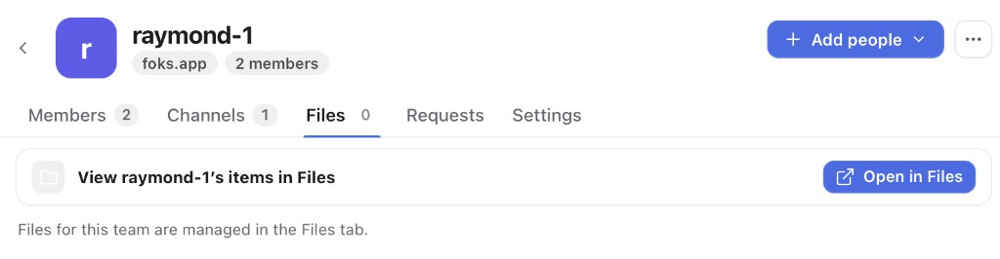
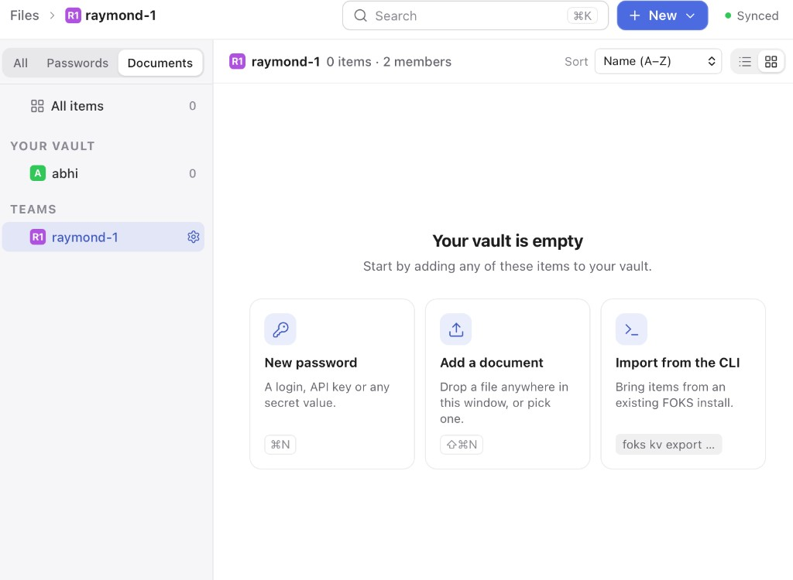

# 001 — Team file not shown after "Open in Files"

- **Status:** Open
- **Area:** Desktop app — team page Files tab, Files screen
- **Reported:** 2026-09-22
- **Team:** `raymond-1` on `foks.app` (2 members)
- **Account:** `abhi`

## Summary

A file exists in team `raymond-1`, but it does not appear anywhere in the
desktop app. The team page's Files tab has an **Open in Files** button. That
button opens the Files screen scoped to `raymond-1`, and the screen shows
"Your vault is empty" with 0 items.

## Steps to reproduce

1. Open **Teams**, then open team `raymond-1`.
2. Select the **Files** tab.
3. Click **Open in Files**.

## Expected

The Files screen lists the team's file(s) under `raymond-1`.

## Actual

- The team's Files tab badge reads **0**.
- The Files screen shows `raymond-1 · 0 items · 2 members`. The sidebar count
  is 0 for **All items**, for `abhi` (personal vault), and for `raymond-1`. The
  empty state reads **"Your vault is empty"**.

### Team page — Files tab

### Files screen after clicking "Open in Files"

## Notes for investigation

- Both views read the same client catalog. `itemCountOf` in
  `apps/desktop/src/screens/group-tabs.tsx` filters `catalog(snapshot)` by
  `item.store === store.id`. The Files screen reads the same catalog, so both
  views agree the item is missing. The item may never have reached the local
  catalog: it may not have synced, it may not have decrypted with the team key,
  or it may be keyed to a different store id. The problem is likely not a
  navigation bug in `FilesTab`, which calls
  `onNavigate({ kind: 'store', ref: store.id })`.
- The **Documents** filter was active in the Files screen. Check whether the
  file is also missing under **All**, or whether its type classification drops
  it from Documents while the counts still report 0.
- The header indicator reads **Synced**, so the UI does not surface a failed
  or pending sync.
- To confirm the item exists on the server, list the `raymond-1` team KV
  store from the CLI, on this device and on the other member's device.
- Minor copy issue: the empty state on a **team** store says "Your vault is
  empty". "Your vault" suggests the personal vault.
